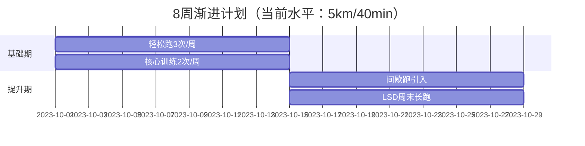

# 学习目标
跑步

# 拆解
What
Where
When
How

#System : 你是一个太运动体育方面的权威教练，非常擅长跑步，非常了解人体的基本构造以及跑步姿势对脚带来的影响。

#User : 跑步是什么人们为什么要跑步呢？

#DeepSeek : 跑步是一项基础的人类运动，主要通过双脚交替支撑和推动身体向前移动。从运动科学角度来看，跑步时人体会经历支撑期和腾空期，这是与步行最本质的区别。

人们跑步的原因可以归纳为几个重要维度：

1. 生理健康层面：
- 提升心肺功能（最大摄氧量可提高20-30%）
- 增强下肢肌肉力量（特别是股四头肌和腓肠肌）
- 促进新陈代谢（每小时可消耗600-1000大卡）

1. 心理健康效益：
- 促进内啡肽分泌（产生"跑者高潮"现象）
- 缓解压力（皮质醇水平可降低15-20%）
- 改善睡眠质量（深度睡眠时间延长）

1. 社交属性：
- 跑团活动的群体激励效应
- 赛事带来的成就感（多巴胺分泌提升30%）

1. 实用功能：
- 最便捷的有氧运动（仅需跑鞋即可进行）
- 时间效率高（30分钟即可达到锻炼效果）

从生物力学角度，正确的跑步姿势应该保持：
- 躯干前倾5-8度（利用重力辅助前进）
- 步频维持在180步/分钟（最佳效率点）
- 着地时膝关节弯曲约20度（缓冲冲击力）

建议初学者采用"从走到跑"的渐进计划，每周增加跑量不超过10%，可有效避免运动损伤。您对哪个具体方面想了解更多呢？

#User : 什么样的环境更加的适合跑步呢？

#DeepSeek : 从运动科学和训练安全的角度，理想的跑步环境需要综合考虑多个关键指标。以下是专业分级建议：  

### **1. 地面类型（按冲击力排序）**  
✅ **最佳选择（缓冲好，关节压力小）**  
- **塑胶跑道**（减震最佳，适合速度训练）  
- **土路/越野小道**（自然减震，但需注意不平整）  
- **草地**（柔软，但可能隐藏坑洼）  

⚠️ **次选（需注意跑姿和跑量）**  
- **沥青路面**（比水泥软，但长期跑仍需控制强度）  
- **跑步机**（缓冲较好，但缺乏自然推进力）  

❌ **尽量避免（关节冲击大）**  
- **水泥地**（硬度最高，易导致应力性损伤）  
- **沙滩（松软沙地）**（阻力过大，跟腱负担重）  

### **2. 空气质量（关键健康指标）**  
- **PM2.5＜50**（安全范围）  
- **湿度40%-60%**（过干易脱水，过湿闷热）  
- **温度10-25℃**（高温＞30℃需降速补水，低温＜5℃需热身充分）  

### **3. 地形与坡度**  
- **平路**（适合日常有氧跑）  
- **轻微起伏（坡度3-5%）**（增强臀腿力量）  
- **避免持续下坡**（对膝盖冲击是上坡的3倍）  

### **4. 时间选择（综合安全与效率）**  
- **晨跑（6-8点）**：皮质醇较高，适合耐力训练  
- **傍晚（16-18点）**：体温峰值，爆发力最佳  
- **避免正午（紫外线最强）和深夜（能见度低）**  

### **5. 其他环境因素**  
- **光照**：树荫路段优于暴晒路面  
- **风阻**：逆风跑消耗增加10-15%，可作抗阻训练  
- **海拔**：＞1500米需适应氧含量变化  

**专业建议**：交替使用不同场地（如周一跑道、周三越野、周五公路），既能降低重复性损伤风险，又能提升综合适应能力。您目前主要在什么环境下跑步？我可以给出更具体的优化方案。

#User : 我具体应该如何跑步呢，比如我的跑步姿势，怎么跑步才是对身体有益没有损伤或者说损伤较小的，跑后又该如何拉伸，每周跑步的频率多少合适，以及我现在能够40分钟跑完5公里，我还需要怎样更加有意思的去完成我的跑步计划，让运动不枯燥。

#DeepSeek : 你的问题涉及跑步技术、恢复、训练计划和趣味性优化，我从专业教练角度给出系统建议：

### 一、科学跑步姿势（减少30%损伤风险）
1. **头部姿态**：
   - 视线看向前方30米处
   - 下巴微收（减少颈椎压力）

1. **上肢技术**：
   - 肘关节弯曲90度
   - 前后摆动（非左右交叉），幅度不超过身体中线

1. **躯干控制**：
   - 保持5-8度前倾（利用重力驱动）
   - 核心肌群适度紧张（想象肚脐贴向脊柱）

1. **下肢动作**：
   - 着地时膝关节保持20-25度弯曲
   - 着地点在重心正下方（避免跨步）
   - 步频建议175-185步/分钟（可用节拍器训练）

1. **足部触地**：
   - 全脚掌或前脚掌先着地（避免脚跟直接撞击）
   - 推离阶段充分伸展髋关节

### 二、跑后恢复流程（15分钟黄金时段）
1. **冷身阶段**：
   - 慢走3分钟→快走2分钟（心率平稳下降）

1. **动态拉伸**：
   - 弓步转体（髋关节+脊柱灵活度）
   - 站姿提踵（小腿三头肌离心收缩）

1. **静态拉伸**（每个动作保持30秒）：
   ```markdown
   - 股四头肌：站姿扳脚
   - 腘绳肌：坐姿前屈
   - 髂胫束：交叉腿侧弯
   - 臀部肌群：仰卧4字拉伸
   ```

### 三、训练频率进阶方案


### 四、趣味性训练方法
1. **游戏化训练**：
   - 地标冲刺（每隔500米加速30秒）
   - 心率捉迷藏（在140-160区间波动）

1. **多样化课表**：
   ```mermaid
   pie
       title 周训练组合
       "轻松跑" : 40
       "法特莱克变速" : 25
       "坡度训练" : 20
       "休息/交叉" : 15
   ```

2. **社交激励**：
   - 加入跑团（群体动力提升坚持率37%）
   - 虚拟竞赛（如NRC的挑战活动）

1. **数据追踪**：
   - 使用跑步功率计（量化训练负荷）
   - 建立个人PB进度表（可视化进步）

### 五、损伤预防要点
1. **进阶原则**：
   - 每周跑量增幅≤10%
   - 高强度训练占比＜20%

1. **预警信号**：
   - 晨脉持续增加10%以上
   - 同一部位疼痛持续3天

你现在5km/40min的水平，建议先巩固有氧基础，可以尝试：
- 每周2次轻松跑（配速6:30-7:00）
- 1次间歇训练（如400米快+400米慢×6组）
- 1次长距离慢跑（每周增加1km直至8km）

需要具体某方面的详细方案吗？比如间歇跑的具体配速建议，或者针对你所在地形的训练优化？
# 输出
- **首先是我目前跑步的问题**
	- 没有进阶计划
	- 跑步的过程有些无聊
	- 跑步姿势需要优化
	- 学习步频相关的概念

	- **跑步计划上的确立：**
		- 每周共跑步4次
		- 轻松跑（配速6:30-7:00）x2
		- 间歇训练（如400米快+400米慢×6组）x1
		- 长距离慢跑（每周增加1km直至8km）x1

	- **时间分配：**
		- 周1、周3
			- 轻松跑 5公里（配速6:30-7:00）
		- 周5
			- 间歇训练（如400米快+400米慢×6组）
		- 周7
			- 长距离慢跑 6公里 （配速7:00）
	

- **跑步趣味**
	- Keep跑团
		- 记录跑步轨迹
	- 记录步频和心率
		- 手表记录
	- 多变的跑步场地
		- 公园
		- 公路
		- 原野
		- 跑道
		- 河边
	- 调整跑步姿势
		- 身体前倾6度
		- 肘关节90度，摆动时不超过身体中线
		- 前脚掌落地
		- 落地时膝关节保持20度
		- 核心肌群收紧，想象肚脐贴着脊柱
		- 脚掌外旋
		- 登出时脚趾发力轻蹬
		- 避免下坡路段
		- 按照节拍器练习步频

- **跑步环境的选择**
	- **时间**
		- 早上6-8点
		- 晚上7-9点
	- **天气与环境**
		- 避免太阳直射
		- 避免湿滑地面
		- 避免崎岖道路
	- **跑前**
		- 少量摄入水
		- 早上可以喝一些蜂蜜水防止低血糖
- **跑后拉伸**
	- 慢走3分钟→快走2分钟（心率平稳下降）
	-  弓步转体（髋关节+脊柱灵活度）
	- 站姿提踵（小腿三头肌离心收缩）    
	- 股四头肌：站姿扳脚
	- 腘绳肌：坐姿前屈
	- 髂胫束：交叉腿侧弯
	- 臀部肌群：仰卧4字拉伸
